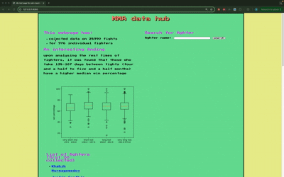
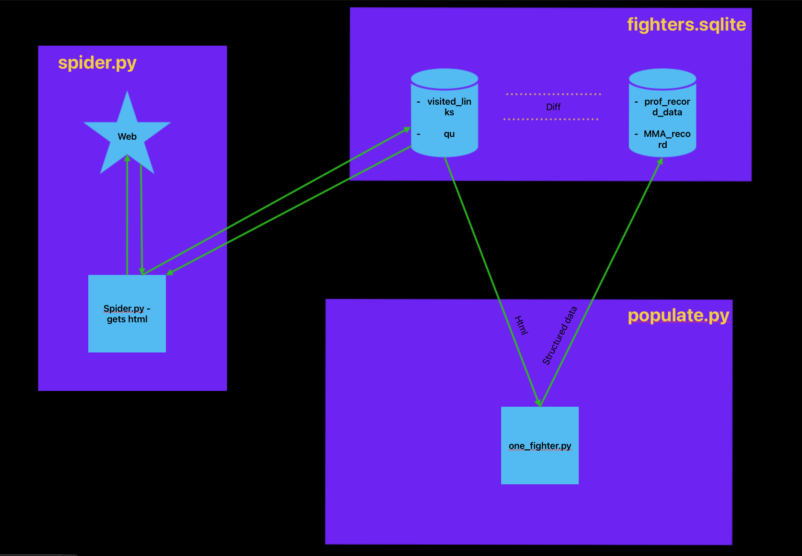

# FullstackMMA_DataHub
## introduction
This project serves as a web page for mixed martial arts enthusiasts. if you are looking for simple statistics and figures on your favorite fighter, look no further.

## technical introduction
To understand the process as a whole, first i wil explain where i got my data from and how i collected it. Then i will explain the user interface (UI) used to interact with the data.

# Data
the data is scraped from wikipedia pages. Mixed martial arts fighters usually have wikipedia pages. The ones that do not, are not accounted for in this project. 
there are two key ares of the HTML in the fighters wikipedia page:
1) a table showing their profesional record
2) a table showing their full figth history

the HTML of these tables is the same (90% of the time) for each fighter in wikipedia which makes automated scraping easy.
so, the wikipedia pages are scraped in an automated fashion using BFS to traverse links.

# UI
The UI is used to interact with the database of fighters collected.
you can:
1) search for fighter in the DB - this displays interesting statistics and a figure showing the fighters fight history.
2) click on a fighter name that is displayed on the website - the same as above is displayed.

# Backend architecture

# API architecture
an interesting part of the APIs is that they run data analysis scripts in python on demand.
whenever you click on a fighters name or search for a fighter, some data analysis is done. 